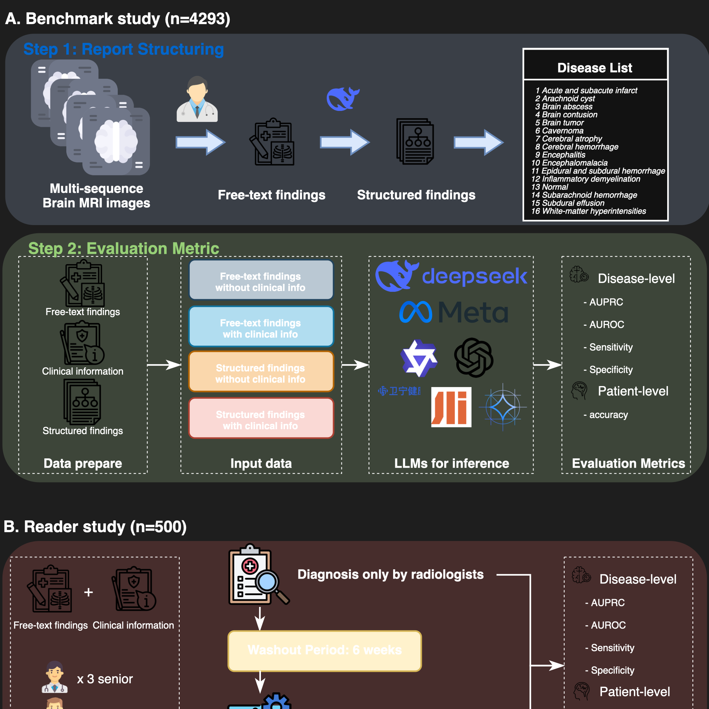
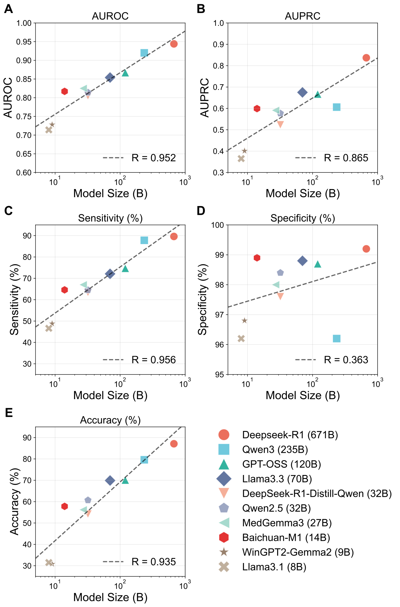

# Evaluation of Large Language Models for Diagnostic Impression Generation from Brain MRI Report Findings: A Multicenter Benchmark and Reader Study

[](https://doi.org/10.1038/s41746-026-02380-4)
[](https://www.nature.com/articles/s41746-026-02380-4)
[](LICENSE)
[](https://www.python.org/downloads/)

## Authors

Ming-Liang Wang<sup>1*</sup>, Rui-Peng Zhang<sup>1*</sup>, Wen-Juan Wu<sup>2*</sup>, Yu Lu<sup>3*</sup>, Xiao-Er Wei<sup>1</sup>, Zheng Sun<sup>1</sup>, Bao-Hui Guan<sup>1</sup>, Jun-Jie Zhang<sup>1</sup>, Xue Wu<sup>4</sup>, Lei Zhang<sup>2#</sup>, Tian-Le Wang<sup>3#</sup>, Yue-Hua Li<sup>1#</sup>

### Institutions

1. Department of Radiology, Shanghai Sixth People's Hospital Affiliated to Shanghai Jiao Tong University School of Medicine, Shanghai, China
2. Department of Radiology, Wuxi No.2 People's Hospital, Jiangnan University Medical Center, Wuxi, China
3. Department of Radiology, Southeast University Affiliated Nantong First People's Hospital, Nantong, China
4. Institute for Global Health Sciences, University of California, San Francisco, CA, USA

<sup>*</sup>Ming-Liang Wang, Rui-Peng Zhang, Wen-Juan Wu and Yu Lu were co-first authors.

<sup>#</sup>**Corresponding authors:** Yue-Hua Li ([liyuehua77@sjtu.edu.cn](mailto:liyuehua77@sjtu.edu.cn)), Tian-Le Wang ([wangtianle9192@163.com](mailto:wangtianle9192@163.com)), Lei Zhang ([leon3183@163.com](mailto:leon3183@163.com))

---

## Graphical Abstract

<p align="center">
  
</p>

<p align="center"><em>Figure 1: Study flowchart showing the evaluation framework for LLMs in brain MRI diagnostic impression generation.</em></p>

## Main Results

<p align="center">
  
</p>

<p align="center"><em>Figure 2: Main results of LLM evaluation on brain MRI diagnostic impression generation.</em></p>

## Overview

This project evaluates the performance of large language models (LLMs) in automated brain MRI report analysis and diagnosis generation. The system follows a rigorous two-stage pipeline:

1. **Structuring Stage**: Converts unstructured MRI findings into standardized formats without accessing diagnostic conclusions (avoiding data leakage)
2. **Diagnostic Inference Stage**: Generates diagnostic conclusions solely from the structured findings

This separation ensures unbiased evaluation of LLMs' diagnostic reasoning capabilities using state-of-the-art language models deployed via vLLM.

## Repository Structure

The repository consists of three main components:

### 1. `prompt.py` - Prompt Engineering Module

Contains all system prompts for different tasks and languages:

- **Report Structuring Prompts**: `SYSTEM_PROMPT_FINDINGS_CHINESE` and `SYSTEM_PROMPT_FINDINGS_ENGLISH` for converting unstructured MRI reports into standardized formats
- **Diagnosis Generation Prompts**: Multiple prompt variants for diagnostic reasoning:
  - `FINDINGS_TO_CONCLUSION_PROMPT_TOP1_*`: Single most likely diagnosis
  - `FINDINGS_TO_CONCLUSION_PROMPT_TOP3_*`: Top 3 differential diagnoses
  - `FINDINGS_TO_CONCLUSION_PROMPT_FREE_*`: Flexible diagnosis approach
- **Language Support**: Both Chinese and English variants for all prompts
- **Disease Classification**: 16 standardized brain pathology categories including normal findings, white matter hyperintensities, cerebral atrophy, acute/subacute infarction, and various other brain lesions

### 2. `finding_structure.py` - Report Structuring Module

Processes raw MRI findings to extract and structure them:

- **Input Processing**: Handles JSON files containing medical reports with original findings (NOT conclusions)
- **AI-Powered Structuring**: Uses DeepSeek models to clean and standardize findings content
- **Output Generation**:
  - Individual JSON files for each processed report
  - Consolidated Excel files for batch analysis
- **Structured Extraction**: Separates overall findings summary from disease-specific findings
- **Data Leakage Prevention**: Only processes findings; conclusions are inferred separately in the diagnosis stage
- **Concurrent Processing**: Multi-threaded processing for efficient batch operations

**Note**: This module intentionally does NOT use the original diagnostic conclusions as input to prevent data leakage. The diagnostic conclusions should be generated by the `diagnosis_from_findings.py` module based on the structured findings.

### 3. `diagnosis_from_findings.py` - Diagnostic Inference Module

Generates diagnostic conclusions from findings (the reasoning stage):

- **Multiple Inference Modes**:
  - `direct`: Uses original findings directly (baseline approach)
  - `struct`: Uses pre-structured findings from `finding_structure.py` (recommended two-stage approach)
- **Flexible Prompting**: Supports different diagnostic approaches (top1, top3, free)
- **Model Compatibility**: Configured for various LLMs with specific parameters
- **Clinical Information Integration**: Optional inclusion of clinical context
- **Robust Processing**: Retry mechanisms and error handling for API reliability
- **Output Management**: Comprehensive result storage with reasoning traces
- **Research-Grade Separation**: The diagnostic reasoning is performed independently from the structuring stage, ensuring unbiased evaluation

## System Requirements

### Hardware Specifications

- **Deployment Platform**: NVIDIA-H20 with 141GB memory each card
- **GPU Configuration**:
  - DeepSeek models: 8 GPUs
  - Qwen3 models: 4 GPUs  
  - Other models: Single GPU

### Software Dependencies

- **Python**: 3.11.7
- **OpenAI API**: 1.71.0
- **Pandas**: 2.1.4
- **Additional packages**: `concurrent.futures`, `tqdm`, `argparse`, `json`

### VLLM Deployment

All models are deployed using Docker containers with VLLM:

- Each model uses the officially recommended VLLM version
- Docker-based deployment for scalability and consistency
- OpenAI-compatible API endpoints for seamless integration

## vLLM + Docker (docker-compose) Deployment

This repository provides **per-model** `docker-compose.yml` templates under `deploy/vllm/` to launch local checkpoints as an **OpenAI-compatible vLLM server** (`/v1/*`).

### Prerequisites

- **Docker** and **Docker Compose v2+**
- **NVIDIA driver** and **NVIDIA Container Toolkit** (for GPU in containers)

### Available compose templates

- `deploy/vllm/deepseek-r1/docker-compose.yml`
- `deploy/vllm/deepseek-v3/docker-compose.yml`
- `deploy/vllm/gpt_oss_120b/docker-compose.yml`
- `deploy/vllm/qwen3_235b_2507/docker-compose.yml`
- (Generic template) `deploy/vllm/docker-compose.yml`

### Quick start (example: DeepSeek-R1)

1. Put model files on the host (example: `/data/models/DeepSeek/DeepSeek-R1`).
1. Export environment variables and start:

```bash
export MODEL_DIR=/data/models
export MODEL_PATH=/models/DeepSeek/DeepSeek-R1
export SERVED_MODEL_NAME=deepseek-r1
export TP_SIZE=8
export MAX_MODEL_LEN=120000
export GPU_MEMORY_UTILIZATION=0.95
export PORT=9990
export VLLM_API_KEY=my-secret-key
export NVIDIA_VISIBLE_DEVICES=all
export CUDA_VISIBLE_DEVICES=0,1,2,3,4,5,6,7

docker compose -f deploy/vllm/deepseek-r1/docker-compose.yml up -d
```

1. Verify:

```bash
curl -s http://localhost:${PORT}/v1/models \
  -H "Authorization: Bearer ${VLLM_API_KEY}" | head
```

### Quick start (example: DeepSeek-V3)

```bash
export MODEL_DIR=/data/models
export MODEL_PATH=/models/DeepSeek-V3-0324
export SERVED_MODEL_NAME=deepseek-chat
export TP_SIZE=8
export MAX_MODEL_LEN=120000
export GPU_MEMORY_UTILIZATION=0.95
export PORT=9990
export VLLM_API_KEY=my-secret-key
export NVIDIA_VISIBLE_DEVICES=all
export CUDA_VISIBLE_DEVICES=0,1,2,3,4,5,6,7

docker compose -f deploy/vllm/deepseek-v3/docker-compose.yml up -d
```

### Quick start (example: GPT-OSS-120B)

```bash
export MODEL_DIR=/data/models/openai-gpt-oss-120b
export SERVED_MODEL_NAME=gpt_oss_120b
export TP_SIZE=1
export MAX_MODEL_LEN=8192
export GPU_MEMORY_UTILIZATION=0.95
export PORT=9001
export VLLM_API_KEY=my-secret-key
export NVIDIA_VISIBLE_DEVICES=0

docker compose -f deploy/vllm/gpt_oss_120b/docker-compose.yml up -d
```

### Quick start (example: Qwen3-235B-2507)

```bash
export MODEL_DIR=/data/models/Qwen3_235B_2507
export SERVED_MODEL_NAME=qwen3_235b_2507
export TP_SIZE=4
export MAX_MODEL_LEN=98976
export GPU_MEMORY_UTILIZATION=0.85
export PORT=9010
export VLLM_API_KEY=my-secret-key
export NVIDIA_VISIBLE_DEVICES=0,1,2,3
export OMP_NUM_THREADS=32

docker compose -f deploy/vllm/qwen3_235b_2507/docker-compose.yml up -d
```

### Python client configuration (OpenAI-compatible)

Point `base_url` to the vLLM server:

```python
from openai import OpenAI

client = OpenAI(
    api_key="my-secret-key",
    base_url="http://localhost:9990/v1",
)
```

### Common variables

- **`MODEL_DIR`**: host directory to mount (read-only) into the container
- **`MODEL_PATH`**: container path to the model checkpoint (used by DeepSeek templates)
- **`PORT`**: host port to expose the vLLM server
- **`SERVED_MODEL_NAME`**: model id returned by `/v1/models` and used in requests
- **`TP_SIZE`**: tensor-parallel size (often equals the number of GPUs)
- **`MAX_MODEL_LEN`**: max context length (larger values require more VRAM)
- **`GPU_MEMORY_UTILIZATION`**: VRAM utilization cap (tune between 0.85 ~ 0.95)
- **`VLLM_API_KEY`**: API key required by the server
- **`NVIDIA_VISIBLE_DEVICES`** / **`CUDA_VISIBLE_DEVICES`**: GPU visibility / pinning

## Installation

1. **Clone the repository**:

```bash
mkdir BrainMIND
cd BrainMIND
wget https://anonymous.4open.science/api/repo/BrainMIND/zip -O BrainMIND.zip
unzip BrainMIND.zip
```

1. **Install Python dependencies**:

```bash
pip install openai==1.71.0 pandas==2.1.4 tqdm
```

1. **Configure API endpoints**:

   - Update the `api_key` and `base_url` in the respective Python files
   - Ensure VLLM services are running and accessible

## Usage

### 1. Report Structuring

Convert raw MRI reports to structured format:

```bash
python finding_structure.py --json_path /path/to/reports.json --language english
```

**Parameters**:

- `--json_path`: Path to input JSON file containing medical reports
- `--language`: Processing language (`chinese` or `english`)

### 2. Diagnostic Inference

Generate diagnostic conclusions from findings:

```bash
python diagnosis_from_findings.py \
    --json_path /path/to/reports.json \
    --model deepseek-reasoner \
    --prompt_type top1 \
    --language chinese \
    --mode struct \
    --max_workers 5
```

**Parameters**:

- `--json_path`: Input JSON file path
- `--model`: AI model selection (deepseek-reasoner, qwen3_235b_2507, etc.)
- `--prompt_type`: Diagnostic approach (`top1`, `top3`, `free`)
- `--language`: Processing language (`chinese`, `english`)
- `--mode`: Input type (`struct` for structured, `direct` for original)
- `--add_clinical_info`: Include clinical information (optional)
- `--max_workers`: Concurrent processing threads

### 3. Supported Models

The system supports multiple state-of-the-art language models:

- `deepseek-reasoner`
- `qwen3_235b_2507`
- `gpt_oss_120b`
- `llama3.3_70b`
- `DeepSeek_Distill_Qwen32B`
- `gpt_oss_20b`
- `Baichuan_M1`
- `wingpt_gemma2_9b`
- `llama3.1_8b`
- And more...

## Output Structure

### Structured Reports

- **Individual JSON files**: Detailed processing results for each report
- **Excel summaries**: Consolidated results for analysis
- **Reasoning traces**: Complete AI reasoning process for transparency

### Diagnostic Results

- **Inference conclusions**: AI-generated diagnostic opinions
- **Confidence scoring**: Multiple diagnosis options with rankings
- **Clinical correlation**: Integration of findings with clinical context

## Disease Classification

The system uses a standardized 16-category disease classification:

1. Normal
2. White-matter hyperintensities
3. Cerebral atrophy
4. Acute/subacute cerebral infarction
5. Encephalomalacia
6. Cerebral hemorrhage
7. Brain contusion
8. Subdural/epidural hematoma
9. Subdural effusion
10. Cavernous angioma
11. Arachnoid cyst
12. Tumor (with subtype specification)
13. Subarachnoid hemorrhage
14. Brain abscess
15. Encephalitis
16. Inflammatory demyelination

## Citation

If you find this work useful, please cite our paper:

```bibtex
@article{wang_evaluation_2026,
  title = {Evaluation of large language models for diagnostic impression generation from brain {MRI} report findings: a multicenter benchmark and reader study},
  author = {Wang, Ming-Liang and Zhang, Rui-Peng and Wu, Wen-Juan and Lu, Yu and Wei, Xiao-Er and Sun, Zheng and Guan, Bao-Hui and Zhang, Jun-Jie and Wu, Xue and Zhang, Lei and Wang, Tian-Le and Li, Yue-Hua},
  journal = {npj Digital Medicine},
  year = {2026},
  issn = {2398-6352},
  url = {https://doi.org/10.1038/s41746-026-02380-4},
  doi = {10.1038/s41746-026-02380-4}
}
```

## License

This project is licensed under the MIT License - see the [LICENSE](LICENSE) file for details.

Copyright (c) 2025 Ming-Liang Wang, Rui-Peng Zhang, Wen-Juan Wu, Yu Lu, Xiao-Er Wei, Zheng Sun, Bao-Hui Guan, Jun-Jie Zhang, Xue Wu, Lei Zhang, Tian-Le Wang, Yue-Hua Li

## Acknowledgments

This research was published in *npj Digital Medicine*.

**Paper:** [https://www.nature.com/articles/s41746-026-02380-4](https://www.nature.com/articles/s41746-026-02380-4)
